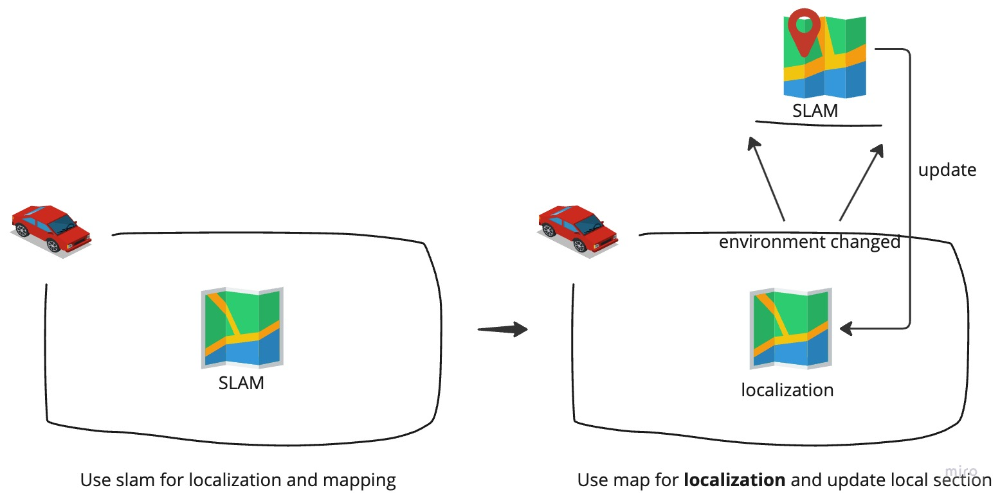

# lifelong_localization
`lifelong_localization` is a new localization framework. After making the SLAM map, we switch to global localization. Furthermore, after the environment changes in some places, we build the map again through slam and update it to the original SLAM map, thus ensure the robustness of the entire system.

